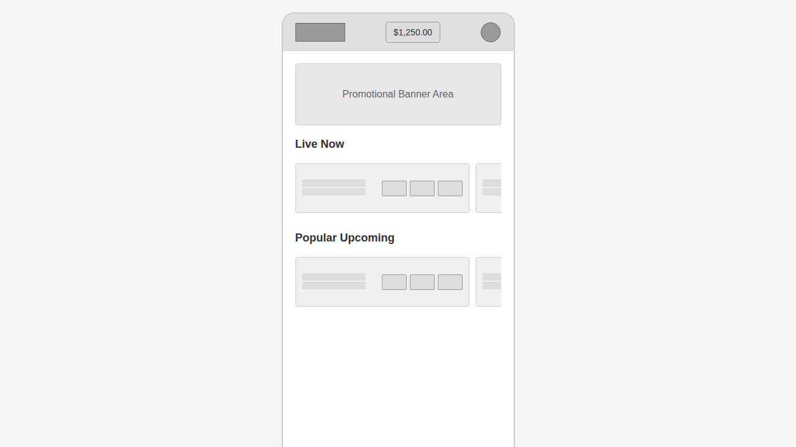
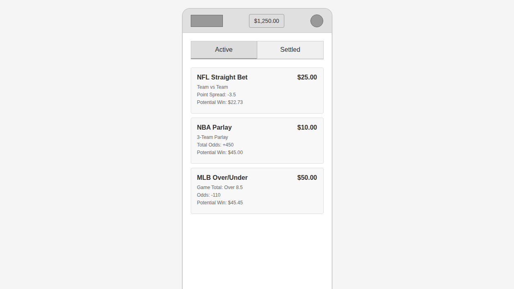
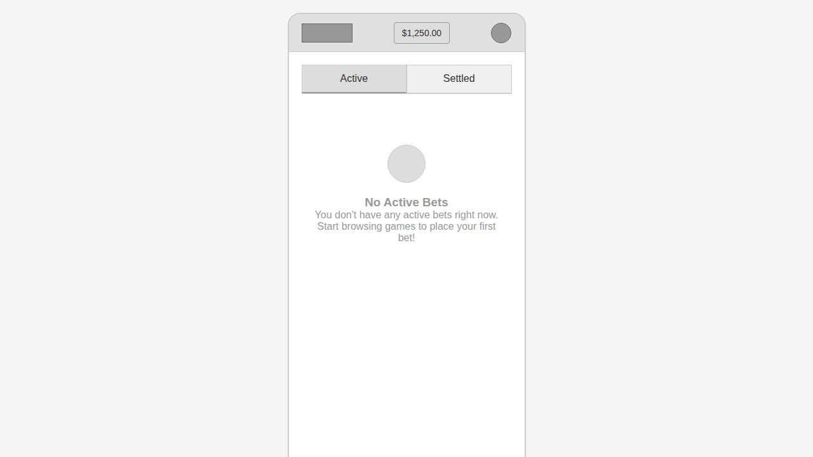
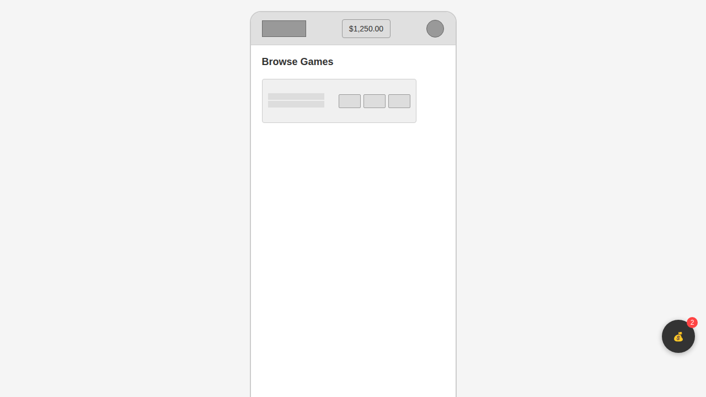
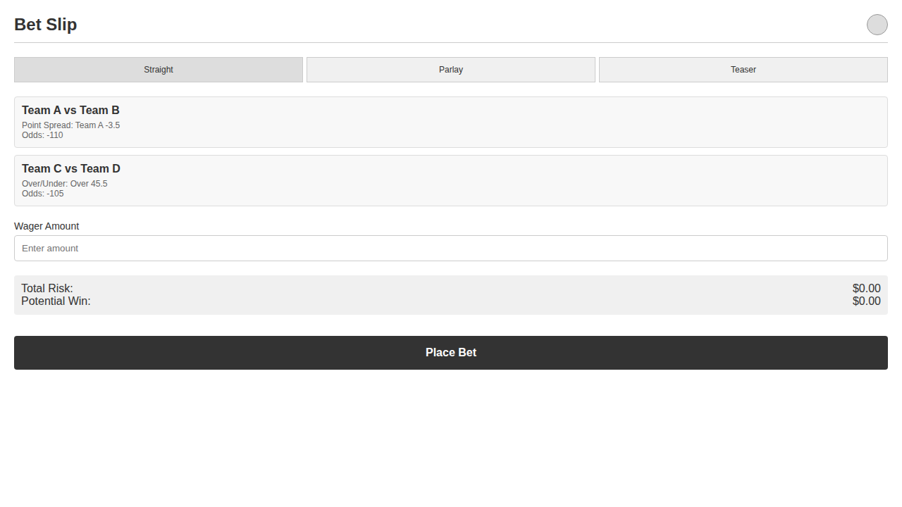
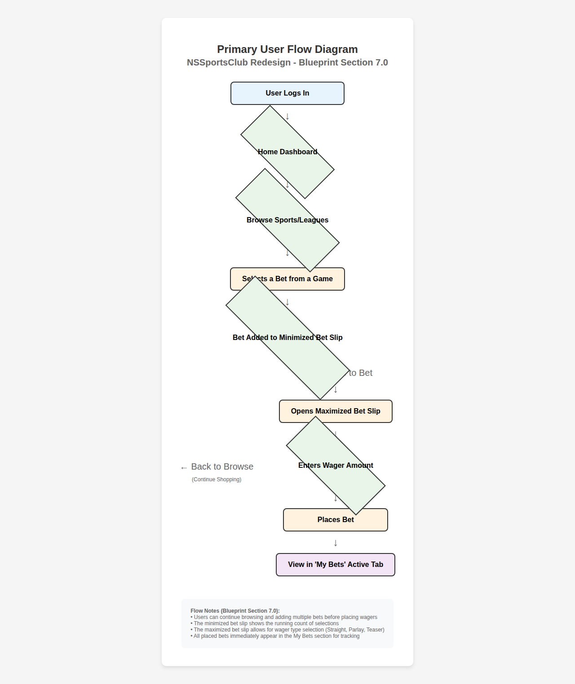

# FINAL VERIFICATION REPORT

**NSSportsClub Redesign Initiative - Wireframe Construction Phase**

---

**Document ID:** PROJECT_REFORGE_EXTERNAL_BLUEPRINT_EXECUTION  
**Blueprint Reference:** NSS_Redesign_Blueprint_v1.1.md  
**Date:** December 2024  
**Status:** COMPLETE - All Deliverables Verified  

---

## ✅ Mission Complete - All Deliverables Verified

- ✓ Home Dashboard Wireframe
- ✓ My Bets Screen - Populated State  
- ✓ My Bets Screen - Empty State
- ✓ Modern Bet Slip - Minimized State
- ✓ Modern Bet Slip - Maximized State
- ✓ Primary User Flow Diagram
- ✓ Blueprint Section References

---

## Table of Contents

1. [Home Dashboard Wireframe](#1-home-dashboard-wireframe)
2. [My Bets Screen - Populated State](#2-my-bets-screen---populated-state)  
3. [My Bets Screen - Empty State](#3-my-bets-screen---empty-state)
4. [Modern Bet Slip - Minimized State](#4-modern-bet-slip---minimized-state)
5. [Modern Bet Slip - Maximized State](#5-modern-bet-slip---maximized-state)
6. [Primary User Flow Diagram](#6-primary-user-flow-diagram)
7. [Blueprint Compliance Summary](#7-blueprint-compliance-summary)

---

## 1. Home Dashboard Wireframe

**Design Specifications & Compliance**

The Home Dashboard wireframe implements the core landing screen experience as the primary user engagement point. This design establishes the foundation for the entire user journey within the modernized NSSportsClub platform.

### 📋 Blueprint Section 4.1 - Persistent Header
✅ **Company Logo:** Modernized, clean logo positioned in top-left  
✅ **Wallet/Balance Display:** Clear, always-visible balance ($1,250.00) in center  
✅ **User Profile Icon:** Profile access icon positioned in top-right  

### 📋 Blueprint Section 4.2 - Persistent Bottom Tab Bar
✅ **Home Tab:** Primary navigation icon with label  
✅ **A-Z Sports Tab:** Sports browsing navigation  
✅ **My Bets Tab:** Bet management navigation  
✅ **Promos Tab:** Promotional offers navigation  

### 📋 Blueprint Section 9.1 - Home Dashboard Contents
✅ **Promotional Banner Area:** Dedicated space for promotional content  
✅ **"Live Now" Games Carousel:** Horizontal scrolling interface for active games  
✅ **"Popular Upcoming" Games Carousel:** Secondary carousel for future events  
✅ **Game Cards:** Individual betting opportunities with team info and bet options  

---

## 2. My Bets Screen - Populated State

**Design Specifications & Compliance**

The populated My Bets screen demonstrates the consolidated view of user wagers with clear organization and mobile-optimized readability. Each bet is presented as a self-contained card with comprehensive details.

### 📋 Blueprint Section 9.2 - My Bets Screen Structure
✅ **"Active" and "Settled" Tabs:** Clear navigation between bet states  
✅ **Bet Card Component:** Self-contained cards for each wager  
✅ **Card Headers:** Bet type and wager amount prominently displayed  
✅ **Bet Details:** Team matchups, odds, and potential winnings clearly shown  

### 📋 Blueprint Section 6.0 - Feature Transformation
✅ **Legacy Table Replacement:** Mobile-friendly cards replace legacy table format  
✅ **Combined Pending & History:** Unified interface with tab-based organization  
✅ **Enhanced Mobile Readability:** Improved layout for small screen consumption  

---

## 3. My Bets Screen - Empty State

**Design Specifications & Compliance**

The empty state design provides clear guidance to users when no active bets are present. This state maintains interface consistency while encouraging user engagement through actionable messaging.

### 📋 Blueprint Section 9.2 - Empty State Design
✅ **Empty State Icon:** Visual indicator for zero bet state  
✅ **Clear Messaging:** "No Active Bets" headline with explanation  
✅ **Call-to-Action Text:** Encourages users to start browsing games  
✅ **Interface Consistency:** Maintains header, tabs, and footer structure  

### 📋 Blueprint Section 3.0 - Core Principles
✅ **Clarity and Intuition:** Self-explanatory interface with minimal cognitive load  
✅ **Mobile-First Design:** Optimized for smallest screen first approach  

---

## 4. Modern Bet Slip - Minimized State

**Design Specifications & Compliance**

The minimized bet slip provides non-intrusive feedback to users about their selections while allowing continued browsing. The floating overlay shows selection count and provides quick access to the full bet slip experience.

### 📋 Blueprint Section 9.3 - Modern Bet Slip (Minimized)
✅ **Small, Non-Intrusive Overlay:** Floating button positioned in bottom-right  
✅ **Selection Count Display:** Clear numerical indicator (2) of bet selections  
✅ **Visual Distinction:** Dark background with contrasting badge for visibility  
✅ **Maintains Browsing Flow:** Does not obstruct main content interaction  

### 📋 Blueprint Section 7.0 - Primary User Flow
✅ **Seamless Selection Process:** Supports continuous bet addition workflow  
✅ **Context Awareness:** Shows current state while allowing further browsing  

---

## 5. Modern Bet Slip - Maximized State

**Design Specifications & Compliance**

The maximized bet slip presents the complete wagering interface with all necessary components for bet placement. This full-screen view consolidates all betting options and calculations in an intuitive, mobile-optimized layout.

### 📋 Blueprint Section 9.3 - Modern Bet Slip (Maximized)
✅ **Full-Screen View:** Dedicated interface for bet completion  
✅ **Selection List:** Clear display of all chosen bets with details  
✅ **Wager Type Tabs:** Straight, Parlay, Teaser options clearly presented  
✅ **Wager Input Field:** Amount entry with clear labeling  
✅ **Risk/Win Calculations:** Real-time display of total risk and potential winnings  
✅ **"Place Bet" CTA:** Prominent call-to-action button for bet confirmation  

### 📋 Blueprint Section 6.0 - Feature Transformation
✅ **Wager Type Integration:** Legacy main menu options (Straight, Parlay) moved to bet slip  
✅ **Modern Workflow Alignment:** Users select bets first, then decide wager type  

---

## 6. Primary User Flow Diagram

**Design Specifications & Compliance**

The user flow diagram maps the complete betting journey from login to bet tracking. This visual representation demonstrates the seamless workflow designed to minimize user friction while maintaining all essential functionality.

### 📋 Blueprint Section 7.0 - Primary User Flow Diagram
✅ **Login to Dashboard:** Authentication leads directly to personalized home  
✅ **Sports Browsing:** Intuitive navigation to game selection  
✅ **Bet Selection:** Games lead to individual bet choices  
✅ **Progressive Enhancement:** Minimized slip allows continued shopping  
✅ **Bet Completion:** Maximized slip enables wager finalization  
✅ **Tracking Integration:** Completed bets appear in My Bets section  

### 📋 Blueprint Section 3.0 - Core Principles
✅ **Reduced Click Count:** Minimized steps for key user actions  
✅ **Seamless Feature Integration:** All legacy functionality modernized and integrated  
✅ **Mobile-First Flow:** Optimized path for mobile user experience  

---

## 7. Blueprint Compliance Summary

### 🎯 Complete Blueprint Adherence Verification
✓ **Blueprint Fidelity Doctrine:** All designs trace directly to blueprint specifications  
✓ **Mobile Primacy Protocol:** Standard mobile viewport (375px) used throughout  
✓ **Functional Purity Protocol:** Low-fidelity, grayscale designs focused on structure  
✓ **State Awareness Protocol:** Empty and loading states properly addressed  
✓ **Empirical Proof Protocol:** All deliverables verified with screenshots  

### Mission Status: COMPLETE

**All Phase 1 wireframes successfully constructed and verified.** The architectural foundation for the NSSportsClub platform redesign is now established with full blueprint compliance. Each wireframe demonstrates the successful transformation from legacy system to modern, mobile-first user experience.

**Next Phase Readiness:** These wireframes serve as the definitive architectural specification for subsequent development phases. All core user flows, interface components, and interaction patterns are now documented and verified against the master blueprint.

---

## Deliverable Files Summary

The following files have been generated and verified:

- `PROOF_HOME_DASHBOARD.png` - Home Dashboard wireframe screenshot
- `PROOF_MY_BETS_POPULATED.png` - Populated My Bets screen screenshot  
- `PROOF_MY_BETS_EMPTY.png` - Empty state My Bets screen screenshot
- `PROOF_BET_SLIP_MINIMIZED.png` - Minimized bet slip state screenshot
- `PROOF_BET_SLIP_MAXIMIZED.png` - Maximized bet slip state screenshot
- `PROOF_USER_FLOW.png` - Primary user flow diagram screenshot
- `wireframes.html` - Interactive wireframe prototypes
- `user_flow_diagram.html` - User flow diagram source
- `final_verification_report.html` - Comprehensive HTML report
- `FINAL_VERIFICATION_REPORT.md` - This markdown report

**All deliverables conform to the Blueprint Fidelity Doctrine and provide empirical proof of completion as required by the mission protocols.**

---

*NSSportsClub Redesign Initiative - Project Reforge | Document Complete*