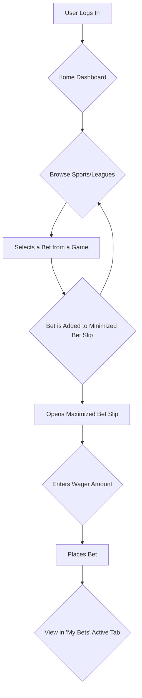

# NorthStar Sports Redesign Initiative: Official Blueprint & Roadmap

**Document ID:** NSS-RBP-2025-09-12
**Version:** 1.1
**Status:** Finalized & Approved for Execution

---

## Table of Contents
1. [Executive Summary](#10-executive-summary)
2. [Legacy System Context](#20-legacy-system-context)
3. [Core Principles & Philosophy](#30-core-principles--philosophy)
4. [Core Information Architecture (IA)](#40-core-information-architecture-ia)
5. [User Authentication Protocol](#50-user-authentication-protocol)
6. [Feature Transformation Plan](#60-feature-transformation-plan)
7. [Primary User Flow Diagram](#70-primary-user-flow-diagram)
8. [Proposed Technology Stack](#80-proposed-technology-stack)
9. [Phase 1: Wireframe & Prototyping Plan](#90-phase-1-wireframe--prototyping-plan)
10. [Document Version History](#100-document-version-history)

---

## 1.0 Executive Summary

This document serves as the single source of truth for the comprehensive redesign of the `nssportsclub.com` platform. It outlines the project's guiding principles, information architecture, feature transformations, and technical roadmap. The objective is to transition the platform from its current outdated state to a modern, mobile-first, and highly intuitive user experience that builds trust and drives engagement. All subsequent design and development work must strictly adhere to this blueprint.

---

## 2.0 Legacy System Context

To provide a complete baseline for this modernization project, a full visual audit of the current legacy platform has been conducted. This audit serves as the "before" state from which we are evolving.

**Reference Material Location:** A complete set of screenshots documenting the current `nssportsclub.com` user interface across all known pages (for both desktop and mobile views) has been archived. These materials are available for reference in the following project directory:
*   `nssports/`

**Note:** This blueprint and the new designs it mandates **supersede the legacy design in all aspects.** The screenshots in the `nssports/` directory are to be used solely for historical context and to ensure all legacy functionality is successfully accounted for in the Feature Transformation Plan (Section 6.0).

---

## 3.0 Core Principles & Philosophy

*   **Mobile-First Design:** The mobile experience is the priority. We will design for the smallest screen first to ensure a focused and clutter-free core application, which will then be scaled up to desktop.
*   **Clarity and Intuition:** The UI must be self-explanatory. We will minimize cognitive load and reduce the number of clicks required for key user actions like finding games and placing bets.
*   **Modern & Trustworthy Aesthetic:** The visual design will be updated to match the standards of industry leaders, utilizing a clean, professional aesthetic to build user trust and confidence in the platform's reliability and security.
*   **Seamless Feature Integration:** All essential legacy functionality will be retained. However, it will be completely reimagined and integrated into modern UI components and workflows that align with current user expectations.

---

## 4.0 Core Information Architecture (IA)

### 4.1 Persistent Header
*   **Purpose:** Provides constant access to core user functions and identity.
*   **Components:**
    *   **[Company Logo]:** A modernized, clean version of the logo.
    *   **[Wallet/Balance Display]:** A clear, always-visible display of the user's primary balance. Tapping this navigates to a detailed funds management screen.
    *   **[User Profile Icon]:** An icon-based link to the `My Account` section.

### 4.2 Persistent Bottom Tab Bar (Primary Navigation)
*   **Purpose:** Provides one-tap global navigation to the main sections of the application.
*   **Components (Icons):**
    *   **[Home]:** The dynamic user dashboard and primary landing screen.
    *   **[A-Z Sports]:** A dedicated screen for browsing all available sports categories.
    *   **[My Bets]:** A consolidated view of all `Pending Bets` and `History`.
    *   **[Promos]:** A section for all promotional offers and bonuses.

---

## 5.0 User Authentication Protocol

*   **Login Mechanism:** User authentication will be handled **exclusively** through the system-provided Username and Password.
*   **Exclusions:** There will be **no integration** for third-party or social logins (e.g., Google, Apple, Facebook). The login screen must be designed solely for the internal credential system to maintain a closed and secure ecosystem.

---

## 6.0 Feature Transformation Plan

| Legacy Feature/Component | Modern Implementation | Rationale |
| :--- | :--- | :--- |
| **Login Screen** | A full-screen, branded page with clear fields for system credentials and a "Forgot Password" link. | Establishes a professional first impression and focuses on the required login method. |
| **Main Menu (Straight, Parlay, etc.)** | These become wager-type selections **inside the Bet Slip component**. | Aligns with universal betting workflows. Users select bets first, then decide how to wager. |
| **`Pending Bets` & `History` Tables** | Combined into the **`My Bets`** screen with "Active" and "Settled" tabs. Each bet is a self-contained "card." | Dramatically improves mobile readability and provides a clear, organized activity log. |
| **Balance Dropdown Menu** | Replaced by the persistent **`Wallet`** component in the header, linking to a full-screen funds view. | Makes the user's balance always visible and accessible, which is critical for trust and engagement. |
| **`My Account` Screen (Table format)** | A dedicated screen accessed via the profile icon, using modern lists and forms. | Improves usability and aligns with standard application design patterns for account management. |
| **"You have a message" Popup** | Replaced by a non-intrusive notification icon (e.g., a bell) in the header. | Improves user experience by removing disruptive popups. Users can check messages at their convenience. |

---

## 7.0 Primary User Flow Diagram

The core betting journey will be architected to be as seamless as possible. The following diagram illustrates the intended high-level workflow.

---

## 8.0 Proposed Technology Stack

*   **UI/UX Design & Prototyping:**
    *   **Tool:** Figma
    *   **Rationale:** Industry-standard tool for collaborative design, component creation, and interactive prototyping. Allows for a seamless handoff to developers.

*   **Front-End Development:**
    *   **Framework:** React (using Next.js) or Vue.js (using Nuxt.js)
    *   **Rationale:** Modern, component-based frameworks that enable the creation of fast, responsive, and maintainable single-page applications. Next.js/Nuxt.js provide performance benefits like server-side rendering.
    *   **Styling:** Tailwind CSS or Styled-Components.

*   **Back-End API Communication:**
    *   **Protocol:** RESTful API or GraphQL.
    *   **Note:** The new front-end will be decoupled from the back-end and will communicate via a well-defined API. The existence and documentation of this API are critical dependencies.

---

## 9.0 Phase 1: Wireframe & Prototyping Plan

The initial design phase will focus on creating low-fidelity wireframes for the three most critical user experience areas.

### 9.1 The Home Dashboard
*   **Objective:** Design the primary landing screen for user engagement.
*   **Contents:** Must include the persistent header and footer, a horizontal "Live Now" games carousel, a "Popular Upcoming" games carousel, and a promotional banner area.

### 9.2 The 'My Bets' Screen
*   **Objective:** Design a clear and consolidated view of all user wagers.
*   **Contents:** Must include the "Active" and "Settled" tabs. The main view will use the "Bet Card" component. A distinct "Empty State" design must also be created.

### 9.3 The Modern Bet Slip
*   **Objective:** Design the interactive component for wager placement.
*   **Contents:** Must include two states:
    1.  **Minimized Overlay:** A small, non-intrusive overlay showing the number of selections.
    2.  **Maximized View:** A full-screen view with the list of selections, tabs for wager types (Straight, Parlay, Teaser), wager input fields, and a clear "Place Bet" CTA.

---

## 10.0 Document Version History

| Version | Date | Author | Changes |
| :--- | :--- | :--- | :--- |
| 1.1 | 2025-09-12 | Project Lead | Added Section 2.0 to reference the `nssports/` directory containing legacy UI screenshots for contextual reference. Updated version number and table of contents. |
| 1.0 | 2025-09-12 | Project Lead | Initial creation and finalization of the complete redesign blueprint. |